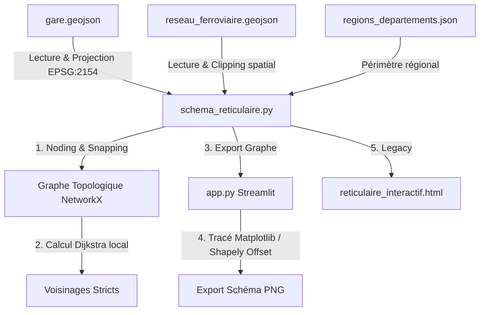

# 🚄 Chronofer - ReticuFer | Guide pour les Agents IA & Développeurs

Ce fichier documente l'architecture, les frameworks, les conventions de style et les règles opérationnelles du sous-projet **Reticulator** au sein de l'écosystème **Chronofer**. Tous les futurs agents IA ou développeurs modifiant ce projet doivent se conformer à ces spécifications.

---

## 📌 Présentation & Objectifs
Le module **Reticulator** (situé dans `reticulator/`) permet de construire un graphe ferroviaire à partir de données géographiques brutes, de calculer la topologie station-à-station (voisinages stricts), et de générer une application web cartographique interactive permettant de définir et tracer 8 relations Origine-Destination (OD).

L'application finale permet :
1. De charger et fusionner des données géographiques ferroviaires (gares + réseau), filtrées par périmètre régional ou national.
2. D'assembler un graphe topologique propre en corrigeant les imperfections géométriques.
3. De calculer les voisinages ferroviaires directs (d'une gare à ses voisines directes sans gare intermédiaire).
4. De paramétrer jusqu'à 8 missions dans l'application Streamlit (`app.py`, référence actuelle) : routage Dijkstra, correction manuelle recollée sur le réseau, rendu cartographique ou schématique, export PNG.

---

## 🏗️ Architecture & Flux de Données

Le projet est minimaliste et s'articule autour d'un script principal et de fichiers de données :



### Fichiers du Projet :
- **`schema_reticulaire.py`** : Backend SIG. Chargement, graphe, voisinages, recollage d'un trajet sur le réseau (`inserer_gare_sur_reseau`, `retirer_gare_sur_reseau`), signes d'offset de corridor (`signes_offset_corridor`) et faisceaux schématiques colinéaires (`offsets_faisceau_schematique`).
- `logo.png` : bloc-marque République française / Cerema, affiché dans l'UI et en bandeau des PNG.
- `branding.py` : composition du bandeau logo sur les exports PNG (carte intacte).
- **`gare.geojson`** : Points géographiques (WGS 84) de l'ensemble des gares d'intérêt.
- **`reseau_ferroviaire.geojson`** : Lignes géographiques de l'infrastructure ferroviaire (MultiLineStrings).
- **`regions_departements.json`** : Découpage région → départements (code INSEE) pour le périmètre régional.
- **`reticulaire_interactif.html`** : Produit legacy autonome (Leaflet). Ne plus étendre : `app.py` est la référence.

---

## 🛠️ Stack Technique & Bibliothèques

### Backend (Python 3.10+)
Le script Python réalise des calculs géospatiaux complexes. Il s'appuie sur :
*   **GeoPandas (`gpd`)** : Lecture et manipulation des GeoDataFrames.
*   **Shapely** : Algorithmes géométriques fondamentaux (`Point`, `LineString`, `offset_curve`).
    *   `STRtree` : Indexation spatiale rapide pour trouver la ligne ferroviaire la plus proche de chaque gare (Snapping).
    *   `substring` : Découpe des lignes ferroviaires au droit des gares.
    *   `offset_curve` / `parallel_offset` : Utilisé dans `app.py` pour écarter physiquement les lignes de mission parallèles.
*   **NetworkX (`nx`)** : Représentation sous forme de graphe (`nx.Graph()`) pour la fusion de nœuds et le routage interactif (Dijkstra) dans `app.py`.
*   **Pandas (`pd`)** : Manipulation tabulaire des GeoDataFrames de gares.
*   **PyProj (`Transformer`)** : Passage du système métrique Lambert 93 (`EPSG:2154`) au système cartographique WGS 84.

### Frontend & Visualisation
L'écosystème comprend deux approches visuelles :
1.  **Application Streamlit (`app.py`) (Référence)** :
    *   S'appuie sur **Streamlit** pour l'interactivité (périmètre, 8 missions, gares desservies vs passage sans arrêt).
    *   Génère les cartes avec **Matplotlib** (mode carte OSM ou mode schéma orthogonal), export PNG carte + légende.
    *   **Style gares (plan type RATP)** : une mission → rond de la couleur de la mission (sans contour) ; plusieurs missions → carré blanc à contour noir. Passage sans arrêt : le trait contourne le symbole, toujours du même côté du corridor. Le *type* de gare (A/B/C) ne colore plus le symbole : il pilote uniquement l'affichage du nom (a/b en mode carte, toutes en mode schéma, taille de police selon le type).
    *   **Offset de corridor** : missions empilées jointives, ordre = indice de mission. Mode carte : `signes_offset_corridor` + `offset_curve`. Mode schéma : `offsets_faisceau_schematique` (rails colinéaires fusionnés, translation X/Y) pour éviter la superposition quand deux missions partagent un axe sans partager les mêmes gares.
    *   **Passage sans arrêt** : pas de symbole si aucune mission ne dessert la gare ; si d'autres s'y arrêtent, `contourne_gare` décale le trait (V vers un apex, même côté que l offset de corridor). Plus de redraw zorder=6 par-dessus le symbole.
2.  **Dashboard HTML (Legacy)** : Autonome (single-file HTML) basé sur **Leaflet.js** et `leaflet-polylineoffset`.

---

## 🎨 Spécifications de Style & Conventions de Code

### Langue et Vocabulaire
*   **Code & Variables** : Le projet utilise une convention mixte. Les fonctions Python et les colonnes de données utilisent le français (e.g. `charger_donnees`, `construire_graphe`, `nom_gare`, `pop_velo`). Les variables internes et les fonctions JavaScript adoptent le CamelCase (e.g. `gareMarkers`, `redrawAllOds`, `dijkstraStations`).
*   **Commentaires** : Rédigés en français pour expliquer les choix algorithmiques et géométriques.

### Python (PEP 8 standard)
*   **Indentation** : 4 espaces (pas de tabulations).
*   **Constantes** : Majuscules avec underscores (e.g. `NODE_PRECISION_M`, `ENDPOINT_MERGE_TOL_M`).
*   **Type de Programmation** : Approche procédurale avec fonctions pures et fonctions d'utilité privées (préfixées par un underscore comme `_node_id_xy`). Éviter l'utilisation excessive de classes.
*   **Intégrité des données** : Toujours forcer la conversion des codes UIC en chaînes de caractères (`str`) avant fusion ou comparaison (`code_uic = code_uic.astype(str)`).

### Javascript / Cartographie
*   **Leaflet** : Les coordonnées géographiques pour Leaflet doivent toujours être au format WGS 84 sous la forme `[latitude, longitude]`.
*   **Simplification visuelle** : Les géométries de cheminement sont simplifiées en métrique via Douglas-Peucker (`SIMPLIFY_TOL_M = 40.0`) avant conversion en WGS 84 pour limiter le nombre de points et alléger le fichier HTML de sortie.

---

## 📐 Paramètres Géospatiaux Critiques (SIG)

Ces valeurs sont codées en dur dans `schema_reticulaire.py` et ne doivent être modifiées qu'avec une grande précaution :
*   `NODE_PRECISION_M = 5.0` : Arrondi spatial (quantification) pour fusionner les nœuds trop proches lors de la discrétisation.
*   `ENDPOINT_MERGE_TOL_M = 50.0` : Tolérance de fusion topologique en mètres. Elle fusionne les nœuds d'extrémités non-gares géographiquement proches pour réparer les discontinuités (trous de numérisation) du réseau brut.
*   `BBOX_BUFFER_DEG = 0.05` : Zone tampon en degrés autour de l'enveloppe des gares pour découper (`clip`) le réseau ferroviaire national et réduire le temps de calcul.
*   `SIMPLIFY_TOL_M = 40.0` : Tolérance de simplification Douglas-Peucker pour les tracés de lignes station-à-station.

---

## 🗄️ Structure des Données d'Entrée

Les agents modifiant les données d'entrée doivent respecter les structures suivantes :

### 1. `gare.geojson`
*   Type : `FeatureCollection` de `Points`.
*   Propriété clé : **`code_uic`** (String, identifiant unique de gare, ex: `"87481184"`).
*   Autres propriétés : `commune`, `nom_gare`, `statut_gare` (doit être `"ouverte"` pour être exploitée), **`type_gare` / `typeGare`** (`a`, `b`, `c` : pilote l'étiquette, plus la couleur du symbole).

### 2. `reseau_ferroviaire.geojson`
*   Type : `FeatureCollection` de `MultiLineString`.
*   Propriétés importantes :
    *   `mnemo` : Code type de voie (`DV` pour Double Voie, `VU` pour Voie Unique, `LGV`).
    *   `infrastructure` : Description de l'état (e.g. `"Double voie électrifiée"`).
    *   `code_ligne` : Code de la ligne SNCF.

### 3. `regions_departements.json`
*   Découpage `{nom_région: [codes départements INSEE]}` servant au filtre de périmètre régional.

> `donnees_gares.xlsx` n'est plus lu par l'application : le type de gare est porté par `gare.geojson`.

---

## ⚠️ Pièges Courants & Solutions Algorithmiques

### 1. Noding des géométries avec Shapely 2.0 / NumPy 2.x
Dans `_noder_reseau()`, l'opération d'union globale (`union_all`) ou la manipulation directe de `MultiLineString`s complexes peut générer des `GeometryCollection` contenant des points isolés ou échouer sous certaines versions de NumPy.
*   *Solution actuelle* : Utilisation d'un `functools.reduce` pour fusionner les lignes de manière itérative :
    ```python
    union = reduce(lambda a, b: a.union(b), lines)
    ```
    Ne pas remplacer cette approche par une méthode simpliste de type `unary_union` sans valider sa compatibilité.

### 2. Orientation des Tracés pour `leaflet-polylineoffset`
Le plugin Leaflet décale les lignes de manière latérale par rapport au sens de dessin de la ligne. Si l'OD 1 va de A vers B et l'OD 2 de B vers A sur la même section, le décalage s'effectuera dans des directions opposées, provoquant une superposition ou un écartement asymétrique.
*   *Solution actuelle* : La fonction JavaScript `getEdgeGeom(a, b)` trie systématiquement les identifiants de gares pour toujours tracer la géométrie dans le sens canonique `min(sid) -> max(sid)` :
    ```javascript
    const [s1, s2] = a < b ? [a, b] : [b, a];
    return [[gareById[s1].lat, gareById[s1].lon], [gareById[s2].lat, gareById[s2].lon]];
    ```
    Toute modification de la méthode d'affichage des tracés ferroviaires doit conserver cette orientation cohérente.

### 3. Offset des missions (ordre constant le long d'un corridor)
`offset_curve` décale à **gauche** du sens de dessin. Les géométries d'arêtes sont stockées dans le sens canonique `min(sid) → max(sid)`. Si on applique l'offset tel quel, l'ordre visuel s'inverse dès qu'un tronçon a des UIC dans l'ordre inverse du parcours : deux missions qui partagent le chemin (direct + omnibus, la direct ne desservant pas les gares intermédiaires) voient leurs traits **alterner** d'une gare à l'autre.

*   *Solution actuelle* :
    *   **Mode carte** : `signes_offset_corridor(liste_steps)` propage un signe (+1 / -1) le long des tronçons consécutifs d'une même mission. L'empilement reste l'ordre des indices de mission ; le signe rend ce rang invariant du côté du faisceau. Ne pas recalculer le signe indépendamment par tronçon à partir de la seule mission « meneuse » locale.
    *   **Mode schéma** : `offsets_faisceau_schematique` fusionne les tronçons *colinéaires et sécants* (même axe, même s'ils n'ont pas la même paire de gares — ex. Côte Bleue et ligne d'Aix qui descendent vers Marseille) puis translate en X/Y. `offset_curve` sur l'arête UIC min→max schématique superpose ces missions.

Les couleurs d'un faisceau sont **jointives** (pas de liseré blanc entre missions). Un casing blanc n'est dessiné que sous le faisceau (`zorder=3`), donc visible sur le pourtour uniquement — un `path_effects` blanc + `capstyle='round'` par trait produisait un effet « boudin » aux gares non desservies.

### 4. Recollage sur le réseau à l'édition manuelle
Retirer/ajouter une gare dans `steps` sans recalculer le plus court chemin produit un tronçon hors graphe (ligne droite, géométrie non calée sur les voies). À une bifurcation, le plus court chemin par défaut peut être le mauvais embranchement.

*   *Solution actuelle* : `inserer_gare_sur_reseau` / `retirer_gare_sur_reseau`. L'insertion épice les plus courts chemins de part et d'autre ; le retrait exclut la gare enlevée pour ne pas la réintroduire. Les gares de passage restent dans `steps` (la desserte se règle via `served_stations`, pas en les retirant du trajet).

### 5. Calcul Dijkstra, gares et étiquettes
Le graphe station-à-station (`neighbors`) porte des géométries métriques orientées `min(sid) → max(sid)`. Z-order : casing 3, traits 4, carrés de gare 5, extrait local des missions sans arrêt 6, noms 7. Les étiquettes évitent les emprises de gares **et** les tampons des tracés (placement prioritaire perpendiculaire à la voie).
